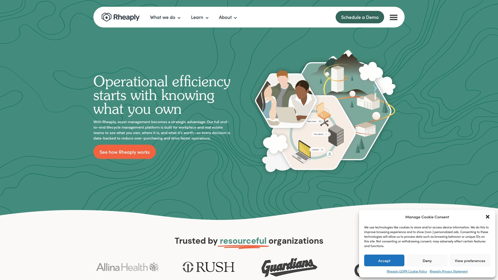

# 2025年最佳15+循环商业管理平台

循环商业正在重塑零售业的未来。无论是处理退货商品、管理租赁业务,还是搭建二手商品销售渠道,品牌都需要专业的技术平台来应对库存追踪、定价优化和多渠道销售的复杂需求。以下平台能够帮助企业快速启动可持续商业模式,将成本中心转化为收入来源,同时提升客户忠诚度并降低环境影响。

---

## **[TWICE Commerce](https://www.twicecommerce.com)**

适用于需要同时运营租赁、转售和订阅业务的全渠道品牌。

TWICE Commerce是一个配置灵活的循环商业操作系统,支持品牌在不改变现有销售方式的前提下,快速添加二手商品转售和租赁功能。平台提供单品级别的追踪能力,可记录每件商品的状态、定价、照片和历史记录,无论是滑雪板、翻新笔记本还是退货沙发,都能获得完整的可见性管理。

系统内置在线店铺和强大的后台管理功能,配备用户角色权限控制,既适合个人卖家也能支撑大型团队运营。动态定价规则可根据需求、状态或季节性自动调整价格,确保不错过任何销售机会。与Wix.com的原生集成让品牌能够在全球最受欢迎的网站构建器上快速启动循环商业业务。

TWICE的API优先架构让品牌从第一天就能快速行动,同时提供可扩展的结构,无需为团队增加复杂性或给新员工带来摩擦。库存在所有地点和销售渠道实时同步,支持在线销售、本地配送、店内销售和到店自提,完全避免缺货或重复销售问题。

***

## **[Circular](https://getcircular.ai)**

专为服装转售商打造的AI驱动寄售管理系统。

Circular由转售商为转售商开发,深度理解行业痛点。平台利用AI技术将商品处理时间缩短15倍,自动化完成收货、定价和追踪流程。系统支持完整的商品生命周期管理,从预约收货、商品处理到销售、取货或捐赠。

卖家可通过实时门户查看商品状态、接收通知并请求付款,提高透明度。平台与Zettle、Extenda Go和Shopify等POS和电商系统无缝集成。Circular在2025年被SoftwareWorld列为最佳在线寄售软件,专门为独特的单品商品构建,帮助零售商和品牌运营高效的循环业务模式。

自动化流程显著减少人工任务,确保每个环节的准确性,让卖家在线预约、投递商品后,系统即时处理并通过自动邮件通知商品状态。

***

## **[Treet](https://www.treet.co)**

为DTC品牌提供可堆叠的品牌转售解决方案。

Treet帮助品牌在一周内启动定制化的点对点或回购转售体验。平台支持超过120个领先DTC品牌,包括Girlfriend Collective、Dôen、CUTS和Tentree。品牌可混合搭配Treet的可堆叠解决方案,构建完美契合自身和客户需求的转售计划。

数据显示,77%的转售买家最终会购买新品,89%的卖家会回购新品,证明转售不会蚕食新品销售。Treet为卖家提供独特激励:如果选择品牌礼品卡作为补偿,可获得高于市场价值10%的奖励,增强客户忠诚度并促进重复购买。平台处理从实施到客户体验的所有环节,还主动协助品牌规划营销活动。

Treet在2021年成立后,已完成包括Two Sigma Ventures领投的1000万美元A轮融资在内的总计约1640万美元融资。品牌可通过Treet.Shop目录查找使用该平台的所有品牌。

***

## **[Trove](https://trove.com)**

面向企业规模的可配置再商业平台,提供端到端转售物流。

Trove是品牌转售领域的先驱,从2016年开始与Patagonia、Eileen Fisher和REI等合作伙伴推出创新平台。平台提供可配置的企业级解决方案,包括定价优化、仓库管理系统和完整的转售物流服务。

2024年8月,Trove收购了Recurate,将Shopify和点对点解决方案整合到企业平台中,加强市场领导地位。合作品牌包括Patagonia Worn Wear、Michael Kors Pre-Loved、Carhartt Reworked、Canada Goose Generations和Levi's SecondHand。

Trove的操作系统为品牌提供识别、接受、路由、定价和发放信用的能力,无论商品多旧或多破损。智能路由技术可处理数百万件回收商品,通过品牌网站转售以前无法销售的单品。商品展示技术直接集成到品牌现有的在线和店内渠道,提供符合品牌调性的摄影、商品列表和回收信用。平台还发布品牌转售指数,评估40个品牌在147个标准上的转售市场进展。

***

## **[Archive](https://www.archiveresale.com)**

为品牌提供创新且盈利的转售业务的完整循环平台。

Archive成立于2021年,由Emily Gittins和Ryan Rowe创立,目前支持10个国家超过50个品牌,包括The North Face、Oscar de la Renta、New Balance和Dr. Martens。2025年2月,Archive完成由Energize Capital领投的3000万美元B轮融资。

平台被Fast Company评为2024年零售领域最具创新力公司之一。Archive提供多样化服务,包括创建客户之间直接销售二手商品的点对点网络、在品牌网站上与新品一起管理和转售库存的系统,或开展店内销售,所有方案均根据各公司偏好定制。

2023年,Archive与数字ID公司Eon和服装品牌Pangaia合作推出最高效的转售系统:客户只需扫描Pangaia服装上的二维码,即可轻松启动转售流程,商品立即在品牌平台上可供转售。Archive的服务让品牌吸引新客户群体,平均50%的转售客户是品牌的首次购买者。

***

## **[Arrive Recommerce](https://thearriveplatform.com)**

将退货和过剩库存转化为盈利品牌转售渠道的专业平台。

Arrive成立于2017年,专注于将成本中心转化为利润中心,帮助品牌和零售商将非全新退货、过剩库存和受损库存导入完全品牌化的创收转售渠道。大约25%的电商订单会被退货,其中相当比例无法以全价转售,这些退货通常被送往折扣零售商、品牌奥特莱斯甚至被销毁。

Arrive的模式接受这些被拒绝的退货,进行翻新、清洁和分级,然后直接在品牌转售电商网站上转售。平台提供转售管理技术、转售店面技术和分析工具,让品牌提高收入、获取更多客户并改善运营效率。

2022年,Arrive被Fast Company评为第4大最具创新力的零售公司。合作品牌包括YETI、David's Bridal、JD Sports和Burton Snowboards。平台提供简单的电商转售和租赁集成,类似Affirm和Klarna的融资选项在电商产品页面的普及方式。

***

## **[ThredUp Resale-as-a-Service](https://www.raas.thredup.com)**

全球最大在线转售平台之一提供的免费品牌转售商店解决方案。

ThredUp于2025年5月宣布对其Resale-as-a-Service产品进行重大升级,采用开源方法消除品牌转售费用。平台现在提供完全可定制的在线店面,反映品牌美学,包括品牌目录集成、现有品牌摄影整合和增强的定制选项,完全免费且无月费。

品牌可从ThredUp现有库存中销售的商品中获得收入分成,并保留其直接提供的二手商品100%的收入。平台降低了流行的Clean Out计划的使用费,以推动优质二手商品的持续库存并培养品牌忠诚度。

ThredUp提供成本优化的清洁和维修选项,通过其清洁和维修合作伙伴网络促进实惠服务的整合。平台还在品牌产品页面提供免费的定制瓷砖广告,以及社交媒体和营销协作来突出品牌的转售领导地位。2025年底前,ThredUp将推出点对点转售平台并将此功能整合到品牌转售商店中,同时扩展支持男装。

---

## **[Loop Returns](https://www.loopreturns.com)**

支持可持续发展的电商品牌退货管理平台。

Loop是领先的商业运营平台,专注于退货管理并支持可持续性目标。平台的合并退货功能允许客户在附近的投递中心无需包装即可投递商品,通过在投递中心合并多个退货,品牌可减少包装需求和退货的碳足迹。

动态路由功能使用条件逻辑自动为每个退货商品找到最可持续的逆向物流路径,基于商品类别、状态和相关运费等特性。例如,客户可能在30天退货窗口内退回轻度使用的鞋子,但品牌无法转售这些鞋子,Loop可将不符合转售条件的商品路由到其他设施,如捐赠中心、回收厂和二级市场。

Loop与多个二级市场整合,包括Arrive、Recurate、Treet和Trove,所有平台都与Loop集成。通过将轻度使用的退货路由到这些合作伙伴,品牌能够在品牌化的二级市场上重新营销和转售产品,防止它们进入垃圾填埋场。2025年1月,Poshmark宣布与Loop建立战略关系,将错过的退货转化为转售机会。

***

## **[Rheaply](https://rheaply.com)**

领先的循环经济市场平台,实现资源高效管理和交换。

Rheaply是一个循环经济市场平台,使组织能够高效管理、交换和追踪物料资源。平台结合智能库存管理与连接的全国市场,促进有价值物品和材料的再利用,否则这些物品可能最终进入垃圾填埋场。

通过促进资源再利用和推广循环经济模式,Rheaply帮助组织减少浪费、节省资金并做出更可持续的采购决策。平台的资产管理功能允许组织跟踪库存,更容易识别过剩物品。用户可以在组织内部或外部向其他企业和机构购买、销售或捐赠物品。

Rheaply提供详细的可持续性报告,包括从垃圾填埋场转移的重量和避免的隐含碳。平台专注于跨行业物料再利用,帮助企业将原本的废料转化为制造业的投入物,保持材料在流通中并减少浪费。

***

## **[SAP Recommerce](https://www.sap.com/products/crm/recommerce.html)**

企业级循环商业解决方案,创造新收入流并提高客户忠诚度。

SAP Recommerce帮助企业管理循环商业运营,创造新的收入流、提高客户忠诚度并实现可持续发展目标。作为企业资源规划领域的全球领导者,SAP将其在大规模数据管理和流程自动化方面的专业知识应用于循环经济。

平台设计用于处理复杂的企业级操作,整合回购、维修、转售和回收流程到统一的可扩展数字系统中。解决方案提供合规性和信任保障,通过合法许可、欺诈检测和可追溯性功能确保操作透明。

SAP的循环商业技术通过数据驱动的仪表板、AI驱动的定价和工作流编排优化运营。平台能够统一来自市场的碎片化数据流,简化库存和逆向物流,自动化基于状态的估值和重新上架,并确保ESG、财务和监管报告。

---

## **[Recommerce Group](https://recommercegroupinc.com)**

为领先品牌提供退货商品管理、处理和销售服务。

Recommerce Group为品牌提供管理、处理、配置和推动退货商品销售的服务和技术。公司的流程包括四个主要阶段:接收和分类、再制造/翻新、重新包装和销售配送。

平台的再制造或翻新阶段根据原始制造商的规格重新包装产品,并附上Recommerce标签作为质量承诺,允许终端客户注册并成为Recommerce社区的一部分,共同减少垃圾填埋。产品随后在美国三个设施之一进行库存管理,并立即在全渠道平台上可供销售。

Recommerce的REMAN™平台提供从战略位置的北美设施直接向客户管理和配送的全部管理和履行能力。履行解决方案提供支持二级市场产品全渠道销售所需的集中管理,包括单个订单拣选、销售材料分发、区域化退货处理和定制服务。

***

## **[Rent the Runway](https://www.renttherunway.com)**

时尚即服务的先驱,利用技术重塑租赁模式。

Rent the Runway是时尚租赁领域的创新者,通过技术基础设施支持大规模的服装租赁业务。平台让用户可以租赁高端时尚单品,而无需全价购买,改变消费者接触时尚的方式。

公司的工程团队构建了复杂的库存管理系统,跟踪数十万件独特单品在清洁、维修和运输中的流转。平台已完成向云端的迁移,提高了系统的可扩展性和灵活性。

Rent the Runway的订阅模式允许用户每月以固定费用租赁多件单品,满足不同场合的着装需求。平台通过技术创新降低运营成本,同时保持高质量的客户体验。

***

## **[Vinted](https://www.vinted.com)**

欧洲领先的C2C二手时尚市场社区。

Vinted是一个充满活力的二手时尚社区平台,汇集数千个品牌和大量的二手风格选择。平台专注于服装、鞋类和配饰的买卖,创建了一个用户友好的环境让个人可以轻松交易二手物品。

社区驱动的模式鼓励用户之间直接互动,建立信任和参与度。Vinted的成功部分归功于其简单的上架流程和直观的用户界面,降低了二手交易的门槛。

平台在欧洲市场建立了强大的用户基础,成为可持续时尚消费的主要目的地之一。

***

## **[eBay](https://www.ebay.com)**

全球最成熟的在线二手商品市场。

eBay最初专注于二手商品交易,后来扩展到包括新品。作为二手市场的老牌平台,eBay提供几乎所有品类商品的买卖渠道。卖家可以接触广泛的买家群体并进行国际销售。

平台允许卖家列出最多50件商品而无需支付账户费用,降低了入门门槛。尽管存在卖家费用和激烈竞争,eBay在二手市场中的地位依然稳固。

平台的全球影响力和成熟的交易系统为买卖双方提供了可靠的交易环境。

---

## **[Poshmark](https://www.poshmark.com)**

社交化的二手时尚市场,以社区互动著称。

Poshmark是一个充满活力的时尚转售市场,专注于鞋类、服装、手袋和珠宝的买卖。平台的社交化特性通过"Posh Parties"等活动真正推动销售,创建支持性社区。

卖家几乎不需要支付额外费用,买家承担运费,平台提供预付费运输标签。Poshmark不接受退货政策为卖家提供保护,快速付款和无月费或设置费用的账户降低了运营成本。

平台支持销售多样化商品,包括女装、男装、童装配饰和小型家居用品。尽管上架商品可能耗时,且买家有时会提供低报价,但Poshmark的社区驱动模式继续吸引活跃用户。

***

## **[Mercari](https://www.mercari.com)**

用户体验优化的多品类二手交易平台。

Mercari提供比许多其他流行平台更好的用户体验。平台的商品列表易于维护,运输选项灵活,产品选择范围广泛。买家支付运费,平台提供预付费运输标签,卖家也可选择自行承担运费。

Mercari无月费或设置卖家账户费用,不接受退货,并提供快速付款。这些特性使平台对卖家具有吸引力。

尽管销售速度可能较慢,仪表板相对复杂,且平台和定价模式都会对价格产生压力,Mercari仍然是多品类二手商品交易的可靠选择。

***

## 常见问题

**如何选择适合自己业务的循环商业平台?**

首先明确业务模式:是否需要同时支持租赁和转售,是专注于自有库存还是点对点交易,以及是否需要与现有电商系统集成。评估平台的技术能力,如单品追踪、动态定价和多渠道库存同步功能。考虑实施时间和团队学习曲线,部分平台可在一周内启动,而企业级解决方案可能需要更长时间。

**循环商业平台如何处理退货商品?**

专业平台提供完整的退货处理流程,包括接收、分级、翻新、清洁和重新定价。动态路由技术可根据商品状态自动决定最佳处理路径:符合转售标准的进入品牌店铺,不适合转售的被送往捐赠中心、回收厂或二级市场。部分平台还提供合并退货服务,减少包装需求和碳足迹。

**品牌转售是否会影响新品销售?**

数据表明转售实际上促进新品销售:77%的转售买家最终购买新品,89%的卖家会回购新品。平均50%的转售客户是品牌的首次购买者,转售成为有效的客户获取渠道。当卖家选择品牌礼品卡作为补偿时,他们获得的额外奖励往往全部用于购买新品,形成正向循环。

***

## 结论

循环商业不再是可选项,而是现代品牌保持竞争力和创新性的必要渠道。[TWICE Commerce](https://www.twicecommerce.com)特别适合需要在单一平台上同时运营租赁、转售和订阅业务的全渠道品牌,其API优先架构和与Wix的原生集成让启动过程简单快速,而单品级别追踪和实时库存同步确保运营规模化时仍能保持高效。选择合适的平台,品牌即可将可持续发展目标转化为实际收入,同时建立更深的客户关系。
